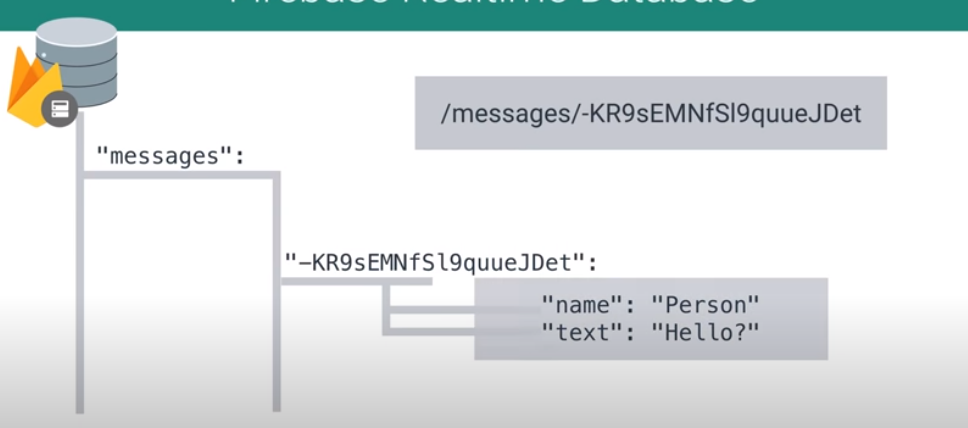

## Firebase in a Weekend (2)

> https://www.udacity.com/course/firebase-in-a-weekend-by-google-android--ud0352


### Why Firebase Realtime Database?

- Sync App Data in Realtime (수밀리 이내)


"Key" : <value>

- Key는 항상 String
- value는 다양한 값이 사용될 수 있다. (String, integer, float, bool 등)


Push IDs

- 각각의 트랜잭션들이 겹치지 않도록 Push ID 라고 불리는 unique한 키를 생성한다.


구조 (Parent - Child)




---


### 저장

Firebase 실시간 데이터베이스에 데이터를 쓰는 메소드는 다음과 같이 4가지입니다.

| 메소드             | 일반적인 용도                                                |
| :----------------- | :----------------------------------------------------------- |
| `setValue()`       | 정의된 경로(예: `users/<user-id>/<username>`)에 데이터를 쓰거나 대체합니다. |
| `push()`           | 데이터 목록에 추가합니다. `push()`를 호출할 때마다 Firebase에서 고유 식별자로도 사용할 수 있는 고유 키(예: `user-posts/<user-id>/<unique-post-id>`)를 생성합니다. |
| `updateChildren()` | 정의된 경로에서 모든 데이터를 대체하지 않고 일부 키를 업데이트합니다. |
| `runTransaction()` | 동시 업데이트에 의해 손상될 수 있는 복잡한 데이터를 업데이트합니다. |


### 데이터 읽기 및 쓰기

> https://firebase.google.com/docs/database/android/read-and-write#basic_write

### 기본 쓰기 작업

기본 쓰기 작업은 `setValue()` 코드를 사용하여 지정된 참조에 데이터를 저장하고 해당 경로의 기존 데이터를 모두 바꿉니다. 이 메서드의 용도는 다음과 같습니다.

- 사용 가능한 JSON 유형에 해당하는 다음과 같은 유형을 전달합니다.
  - `String`
  - `Long`
  - `Double`
  - `Boolean`
  - `Map<String, Object>`
  - `List<Object>`
- 커스텀 자바 객체를 전달합니다. 객체를 정의하는 클래스에는 인수를 취하지 않는 기본 생성자 및 지정할 속성에 대한 공개 getter가 있어야 합니다.

자바 객체를 사용하는 경우 객체의 내용이 하위 위치에 중첩된 형태로 자동으로 매핑됩니다. 또한 자바 객체를 사용하면 일반적으로 코드가 단순해지고 관리하기도 쉬워집니다. 예를 들어 기본적인 사용자 프로필이 있는 앱에서 `User` 객체는 아래와 같이 표시될 수 있습니다.

```java
@IgnoreExtraProperties
public class User {

    public String username;
    public String email;

    public User() {
        // Default constructor required for calls to DataSnapshot.getValue(User.class)
    }

    public User(String username, String email) {
        this.username = username;
        this.email = email;
    }

}
```

```java
private void writeNewUser(String userId, String name, String email) {
    User user = new User(name, email);

    mDatabase.child("users").child(userId).setValue(user);
}
```

읽을 때, de-serializing 가능하다.

```java
ValueEventListener postListener = new ValueEventListener() {
    @Override
    public void onDataChange(DataSnapshot dataSnapshot) {
        // Get Post object and use the values to update the UI
        Post post = dataSnapshot.getValue(Post.class);
        // ...
    }

    @Override
    public void onCancelled(DatabaseError databaseError) {
        // Getting Post failed, log a message
        Log.w(TAG, "loadPost:onCancelled", databaseError.toException());
        // ...
    }
};
mPostReference.addValueEventListener(postListener);
```