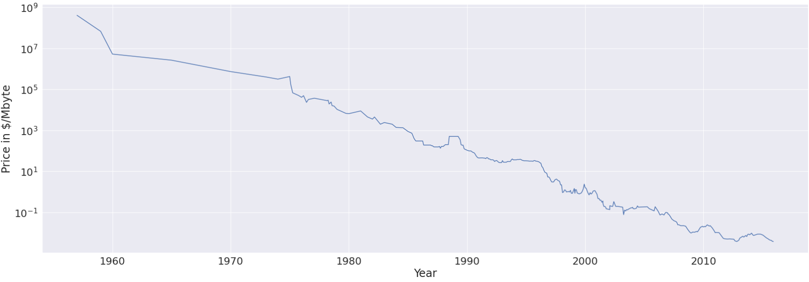

## IMLP (2) - Supervised Learning

- Regression, Classification
- Generalization, Overfitting, Underfitting

[Colab code - IMLP(2)](https://colab.research.google.com/drive/1xsOdR-aVVOiImimhQ9JiEUQcmaf4fTzV)

### 유방암 데이터 이용하기

```python
import numpy as np
from sklearn.datasets import load_breast_cancer
cancer = load_breast_cancer()

print('target : {}'.format(
    {target : count for target, count in zip(cancer.target_names, np.bincount(cancer.target))}))
# target : {'malignant': 212, 'benign': 357}
```

​	타겟 데이터가 유방암 데이터처럼 불균형한 비를 이룰 때는 제대로 된 학습 및 테스트가 불가능하다. **이처럼 구성비가 다른 불균형 데이터를 다룰 때에 `train_test_split` 함수에서 `stratify=y_data` 옵션을 사용**해준다.

```python
from sklearn.model_selection import train_test_split

X_train, X_test, y_train, y_test = train_test_split(
    cancer.data, cancer.target, stratify=cancer.target, random_state=1)
```

#### 최근접 이웃 (K-NN)	

​	최근접 이웃 알고리즘은 가까운 이웃들의 값을 이용하여 예측하는 방법이다. 따라서 예측시 살펴볼 이웃들의 갯수에 따라 예측값이 변할 수 있다.

```python
import matplotlib.pyplot as plt
from sklearn import neighbors

training_acc = []
test_acc = []

neighbors_settings = range(1,11)

for n_neighbors in neighbors_settings:
  clf = neighbors.KNeighborsClassifier(n_neighbors = n_neighbors)
  clf.fit(X_train, y_train)

  training_acc.append(clf.score(X_train, y_train))
  test_acc.append(clf.score(X_test, y_test))

plt.plot(neighbors_settings, training_acc, label='training accuracy')
plt.plot(neighbors_settings, test_acc, label='test accuracy')

plt.ylabel('Accuracy')
plt.xlabel('n_neighbors')
plt.legend()
```


#### KNN Regressor

​	KNN 알고리즘을 이용하여 회귀 문제를 분석할 수도 있다. sklearn의  `KNeighborsRegressor`에서 구현되어 있다. 이웃들의 평균값을 예측값으로 사용한다.

```python
reg = neighbors.KNeighborsRegressor(n_neighbors=9)
reg.fit(X_train, y_train)
reg.score(X_test, y_test)
```

> while the nearest k-neighbors algorithm is easy to understand, it is not often used in practice, due to prediction being slow and its inability to handle many features. 
> 최근접 이웃 알고리즘은 이해하기 쉽지만, 실제 예측에는 잘 사용되지 않는다. 예측 속도가 아주 느리고, 다양한 수의 피쳐를 핸들링하기에 좋지 않다.

### Boston 데이터 이용하기

​	회귀 문제를 분석할 때는 보통 Linear, Ridge, Lasso regression 모형을 사용한다.

```python
from sklearn.datasets import load_boston
from sklearn.model_selection import train_test_split

boston = load_boston()
X_train, X_test, y_train, y_test = train_test_split(
    boston.data, boston.target, random_state=65)
```

#### linear regression

```python
from sklearn.linear_model import LinearRegression
lr = LinearRegression().fit(X_train, y_train)

print('Training set score : {:.2f}%'.format(lr.score(X_train, y_train)))
print('Test set score : {:.2f}%'.format(lr.score(X_test, y_test)))
```

#### ridge regression

```python
from sklearn.linear_model import Ridge
ridge = Ridge().fit(X_train, y_train)

print('Training set score : {:.2f}%'.format(ridge.score(X_train, y_train)))
print('Test set score : {:.2f}%'.format(ridge.score(X_test, y_test)))
```

#### lasso regression

```python
from sklearn.linear_model import Lasso
lasso = Lasso().fit(X_train, y_train)

print('Training set score : {:.2f}%'.format(lasso.score(X_train, y_train)))
print('Test set score : {:.2f}%'.format(ridge.score(X_test, y_test)))
print('Number of features used: {}'.format(np.sum(lasso.coef_ !=0)))	# 10
```

#### ridge, lasso regression with alpha

​	릿지, 라소 회귀 모형에는 정규화를 위한 파라미터인 alpha 값이 있다. (default 1.0)  이 값을 이용하여 사용하는 계수와의 결합도를 조정할 수 있다. alpha 값이 0에 가까워질수록 (계수 결합도를 강하게 가져갈수록) linear regression 모델과 비슷한 양상을 보인다. lasso regression의 경우, alpha 값을 줄일수록(데이터를 좀 더 적합시킬수록) 사용하는 계수가 늘어나는 것을 확인할 수 있다. Train / Test 정확도를 확인하면서 과대/과소 적합에 유의하여 적절한 값을 찾아가는 것이 중요하다.

> **A lower alpha allowed us to fit a more complex model**, which worked better on the training and test data.

```python
# ridge,lasso regression set alpha

from sklearn.linear_model import Ridge, Lasso
ridge = Ridge(alpha=0.001).fit(X_train, y_train)

print('Training set score : {:.2f}%'.format(ridge.score(X_train, y_train)))
print('Test set score : {:.2f}%'.format(ridge.score(X_test, y_test)))

lasso = Lasso(alpha=0.01, max_iter=100000).fit(X_train, y_train)
print('Training set score : {:.2f}%'.format(lasso.score(X_train, y_train)))
print('Test set score : {:.2f}%'.format(ridge.score(X_test, y_test)))
print('Number of features used: {}'.format(np.sum(lasso.coef_ !=0)))	# 13
```

### 다시 유방암 데이터  (로지스틱 회귀)

#### LinearSVC, Logistic Regression

​	분류를 위한 로지스틱 회귀 모델에는 LinearSVC(SVM), Logistic Regression 등이 있다. sklearn에서 제공하는 유방암 판별 데이터셋은 이 모델을 사용할 때 0.92% 이상의 정확도를 가진다.

```python
for model in [LinearSVC(), LogisticRegression()]:
    clf = model.fit(X_train, y_train)
    print('{:.2f}%'.format(clf.score(X_train,y_train)))
    print('{:.2f}%'.format(clf.score(X_test,y_test)))
```

​	이 분류 모델들은 C라고 하는 trade-off 파라미터를 가지고 있는데, 정규화와 관련이 있다. 높은 C 값을 가질수록 좀 더 데이터에 fit 한 데이터를 가지게 된다. (낮은 정규화)

```python
logreg100 = LogisticRegression(C=100).fit(X_train, y_train)
print('{:.2f}%'.format(logreg100.score(X_train,y_train)))	# 0.95%
print('{:.2f}%'.format(logreg100.score(X_test,y_test)))	# 0.93%

logreg001 = LogisticRegression(C=0.01).fit(X_train, y_train)
print('{:.2f}%'.format(logreg001.score(X_train,y_train)))	# 0.94%
print('{:.2f}%'.format(logreg001.score(X_test,y_test)))	# 0.94%
```

```python
plt.plot(logreg100.coef_.T, '^', label="C=100")
plt.plot(logreg001.coef_.T, 'v', label="C=0.001")
plt.xticks(range(cancer.data.shape[1]), cancer.feature_names, rotation=90)
plt.hlines(0, 0, cancer.data.shape[1])
plt.ylim(-5, 5)
plt.xlabel("Coefficient index")
plt.ylabel("Coefficient magnitude")
```


​	모델 계수는 30개, 경계선은 1개의 직선으로 모델 생성됨.

```python
linear_svm = LinearSVC().fit(X_train, y_train)
print('Coefficient shape : ', linear_svm.coef_.shape)
print('Intercept shape : ', linear_svm.intercept_.shape)

# Coefficient shape :  (1, 30)
# Intercept shape :  (1,)
```

***※ KNN 을 그림으로 잘 표현할 수 있는 방법!? 찾아보기***


​	sklearn 의 fit method는 self 를 반환한다. 그 특성을 이용하여 아래와 같이 사용할 수 있다. (Method chaining)

```python
# instantiate model and fit it in one line
logreg = LogisticRegression().fit(X_train, y_train)

# fit and predict in one line
logreg = LogisticRegression()
y_pred = logreg.fit(X_train, y_train).predict(X_test)

# instantiation, fitting, and predicting in one line
y_pred = LogisticRegression().fit(X_train, y_train).predict(X_test)
```

### Naive Bayes Classifiers

​	나이브 베이즈 분류기는 이전에 봤던 기타 리니어 모델과 매우 유사하다. 하지만 트레이닝이 매우 빠르다는 장점이 있고, 이는 LogisticRegression, LinearSVC 보다 더 나은 성능을 보이기도 한다. 나이브 베이즈 모델은 각 피쳐들을 독립적으로 보고 피쳐들로부터 각각의 클래스를 통계내는 방식으로 학습한다. 아래는 위키에 소개된 나이브 베이즈 자료이다.

>[위키백과 - 나이브 베이즈 분류]([https://ko.wikipedia.org/wiki/%EB%82%98%EC%9D%B4%EB%B8%8C_%EB%B2%A0%EC%9D%B4%EC%A6%88_%EB%B6%84%EB%A5%98](https://ko.wikipedia.org/wiki/나이브_베이즈_분류))
>
>​	 나이브 베이즈는 분류기를 만들 수 있는 간단한 기술로써 단일 알고리즘을 통한 훈련이 아닌 일반적인 원칙에 근거한 여러 알고리즘들을 이용하여 훈련된다. **모든 나이브 베이즈 분류기는 공통적으로 모든 특성 값은 서로 독립임을 가정한다.** 예를 들어, 특정 과일을 사과로 분류 가능하게 하는 특성들 (둥글다, 빨갛다, 지름 10cm)은 나이브 베이즈 분류기에서 특성들 사이에서 발생할 수 있는 연관성이 없음을 가정하고 각각의 특성들이 특정 과일이 사과일 확률에 독립적으로 기여 하는 것으로 간주한다.  
>
>​	나이브 베이즈의 장점은 다음과 같다. 첫째, 일부의 확률 모델에서 나이브 베이즈 분류는 [지도 학습](https://ko.wikipedia.org/wiki/지도_학습) (Supervised Learning) 환경에서 매우 효율적으로 훈련 될 수 있다. 많은 실제 응용에서, 나이브 베이즈 모델의 파라미터 추정은 [최대우도방법](https://ko.wikipedia.org/wiki/최대가능도방법) (Maximum Likelihood Estimation (MLE))을 사용하며, [베이즈 확률론](https://ko.wikipedia.org/wiki/베이즈_확률론)이나 베이지안 방법들은 이용하지 않고도 훈련이 가능하다. 둘째, 분류에 필요한 파라미터를 추정하기 위한 트레이닝 데이터의 양이 매우 적다는 것이다. 셋째, 간단한 디자인과 단순한 가정에도 불구하고, 나이브 베이즈 분류는 많은 복잡한 실제 상황에서 잘 작동한다. 2004 년의 한 분석[[3\]](https://ko.wikipedia.org/wiki/나이브_베이즈_분류#cite_note-3)은 나이브 베이즈 분류의 이러한 능력에 명확한 이론적인 이유가 있음을 보여 주었다. 또한 2006 년에는 다른 분류 알고리즘과의 포괄적인 비교를 통하여 베이지안 분류는 부스트 트리 또는 [랜덤 포레스트](https://ko.wikipedia.org/wiki/랜덤_포레스트)와 같은 다른 접근 방식을 넘어섰다는 것이 밝혀졌다.[[4\]](https://ko.wikipedia.org/wiki/나이브_베이즈_분류#cite_note-4)

​	sklearn 에는 **`GaussianNB`(연속적 데이터), `BernoulliNB`(이진 데이터), `MultinomialNB`(카운트 데이터)** 등으로 구현되어 있다. MultinomialNB, BernoulliNB 는 각각 알파 값을 가지고 있으며 라소, 릿지 리그레이션 때처럼 모델의 복잡도를 조정할 수 있다. 주로 고차원 희소 데이터에 좋은 성능을 보일 수 있으며 상대적으로 파라미터에 대해 강건하다. 데이터셋이 아주 커서 리니어 모델의 학습시간이 너무 오래 걸릴 경우, 일종의 베이스 라인 모델로 사용하기에 좋다.

>The naive Bayes models share many of the strengths and weaknesses of the linear models. They are very fast to train and to predict, and the training procedure is easy to understand. **The models work very well with** **high-dimensional sparse data and are relatively robust to the**
>**parameters. Naive Bayes models are great baseline models and are often****used on very large datasets**, where training even a linear model might take too long.

### Decision Tree (의사 결정 나무)

​	분류 / 회귀 문제 등에 사용할 수 있다. 계층적으로 if/else 문제를 배우고, 결정을 따라가는 알고리즘이다. 데이터를 분석하여 이들 사이에 존재하는 패턴을 예측 가능한 규칙들의 조합으로 나타내며, 그 모양이 나무와 같다고 해서 의사 결정 나무라 불린다. 일종의 20 Questions, 스무고개과 비슷한 개념이다.

※ IMLP P. 64 Figure 2-22. A decision tree to distinguish among several animals 그림 삽입

#### 유방암 데이터에서의 의사결정트리

​	유방암 데이터를 의사 결정 트리를 이용하여 풀어본다.

```python
from sklearn.tree import DecisionTreeClassifier
from sklearn.model_selection import train_test_split
from sklearn.datasets import load_breast_cancer

cancer = load_breast_cancer()
X_train, X_test, y_train, y_test = train_test_split(
    cancer.data, cancer.target, stratify=cancer.target, random_state=42)
```

```python
tree = DecisionTreeClassifier(random_state=0)
tree.fit(X_train, y_train)

print('training set : {:.3f}'.format(tree.score(X_train, y_train)))
print('test set : {:.3f}'.format(tree.score(X_test, y_test)))
```

​	사이킷런 `DecisionTreeClassifier` 에서 max_depth를 설정하지 않을 경우, 트리를 임의로 깊고, 복잡하게 설계한다.(arbitrarily deep and complex) 그럼 충분히 모든 데이터를 이용하여 트리를 생성할 수 있기 때문에 트레이닝에 사용한 데이터의 정확도는 100%가 나온다.

```
training set : 1.000
test set : 0.937
```

```python
# Restrict depth of decision tree

tree = DecisionTreeClassifier(max_depth=4, random_state=0)
tree.fit(X_train, y_train)

print('training set : {:.3f}'.format(tree.score(X_train, y_train)))	# 0.0988
print('test set : {:.3f}'.format(tree.score(X_test, y_test)))	# 0.951
```

#### Analyzing decision trees

​	graphviz 를 이용하여 decision tree 가 어떤 식으로 평가하는 모델을 만들었는지 시각화해본다.

```python
from sklearn.tree import export_graphviz

export_graphviz(tree, out_file='tree.dot', class_names=['maligent', 'benign'],
                feature_names=cancer.feature_names, impurity=False, filled=True)
```

```python
import graphviz

with open('tree.dot') as f:
  dot_graph = f.read()

graphviz.Source(dot_graph)
```


#### 트리의 Feature importance 살펴보기

​	전체적인 트리 모델을 보는 것도 좋지만 간단히 피쳐 임포턴스를 확인할 수 있다. 참고로 피쳐 임포턴스 값의 합은 항상 '1'이다.

```python
print('Feature importance : \n {}'.format(tree.feature_importances_))
```

```
Feature importance: 
 [0.         0.         0.         0.         0.         0.
 0.         0.         0.         0.         0.01019737 0.04839825
 0.         0.         0.0024156  0.         0.         0.
 0.         0.         0.72682851 0.0458159  0.         0.
 0.0141577  0.         0.018188   0.1221132  0.01188548 0.        ]
```

​	seaborn 을 이용하여 시각화한다. 시각화 결과, 피쳐 중요도가 높은 변수는 'worst radius'이다. 높은 피쳐 임포턴스를 가진 변수는 트리에서 가지치기에 아주 중요한 요소이다. 반면에 낮은 피쳐 임포턴스를 가진 변수는 사실상 쓸모가 없다. 다른 변수를 이용하더라도 같은 정보를 줄 수 있는 수준의 변수라는 뜻이다.

```python
import seaborn as sns
import matplotlib.pyplot as plt

plt.figure(figsize=(30,10))
plt.xticks(rotation = -90)

sns.barplot(x=cancer.feature_names, y=tree.feature_importances_)
```

#### 

#### Ram 가격 예측 모델 만들기

​	연도별 램 가격 데이터를 학습하고, 가격을 예측하는 모델을 만든다. 데이터는 [여기](https://github.com/dgjung0220/introduction_to_ml_with_python/blob/master/data/ram_price.csv) 를 이용한다. semilogy 를 이용하여 로그스케일 그래프를 그린다. (y 축을 로그스케일로 표현하여 x값의 증가에 따라 기하급수적인 그래프를 보기 좋게 선형적으로 증가하도록 보이게 그린다.)

```python
import pandas as pd
ram_prices = pd.read_csv("ram_price.csv")

plt.figure(figsize=(30,10))
plt.semilogy(ram_prices.date, ram_prices.price)
plt.xlabel("Year")
plt.ylabel("Price in $/Mbyte")
```



```python
from sklearn.tree import DecisionTreeRegressor
from sklearn.linear_model import LinearRegression

data_train = ram_prices[ram_prices.date < 2000]
data_test = ram_prices[ram_prices.date >= 2000]

X_train = data_train.date[:,np.newaxis]
# use a log-transform to get a simpler relationship of data to target
y_train = np.log(data_train.price)
tree = DecisionTreeRegressor().fit(X_train, y_train)
linear_reg = LinearRegression().fit(X_train, y_train)

# predict
X_all = ram_prices.date[:, np.newaxis]

pred_tree = tree.predict(X_all)
pred_lr = linear_reg.predict(X_all)

# Undo log-transform
price_tree = np.exp(pred_tree)
price_lr = np.exp(pred_lr)

plt.figure(figsize=(30,10))
plt.semilogy(data_train.date, data_train.price, label='Training data')
plt.semilogy(data_test.date, data_test.price, label='Test data')
plt.semilogy(ram_prices.date, price_tree, label = "Tree prediction")
plt.semilogy(ram_prices.date, price_lr, label = "Linear prediction")
plt.legend()
```


​	결과를 보면, linear regression 데이터는 2000년 이후도 잘 예측했다. 하지만 decision tree 의 경우, 2000년부터는 가장 마지막 값이 지속되었다. 왜 이런 형편없는 예측을 했을까. decision tree는 새롭게 적용되는 반응에 대해 전혀 예측 능력이 없다. 이 특성은 decision tree 를 베이스로 하는 모든 모델에서 동일하다. (**정확히 말하면 분석용 자료에만 의존하는 의사결정 트리는 새로운 자료의 예측에서 불안정할 가능성이 매우 높다.**)

> ​	Decision trees have two advantages over many of the algorithms we’ve discussed so far: the resulting model can easily be visualized and understood by non-experts (at least for smaller trees), and the algorithms are completely invariant to scaling of the data.

시각화가 용이하고, 비전문가가 이해하기도 편하다. 데이터의 스케일링을 신경쓰지 않아도 된다.

> ​	 As each feature is processed separately, and the possible splits of the data don’t depend on scaling, no preprocessing like normalization or standardization of features is needed for decision tree algorithms. In particular, decision trees work well when you have features that are on completely different scales, or a mix of binary and continuous features.

선형성이나 정규성 또는 등분산성 등의 가정을 필요로 하지 않는 **비모수적인 방법**이다. 또한 의사결정트리에는 순서형 또는 연속형 변수는 단지 순위만 영향을 주기 때문에 이상치에 민감하지 않는 장점을 가지고 있다.

#### Decision Tree 의 앙상블 기법

[colab 소스 코드](https://colab.research.google.com/drive/1IOjkUEqR0haV05_hKRcf5c4HBeaLMJ3k#scrollTo=RZs0JNA1dZ5l)

​	특정한 하나의 예측 모형을 사용하는 것이 아니라 복수의 예측 모형을 결합하여 더 나은 성능을 예측하려는 시도. 일반적으로 계산량은 증가하지만, 단일 모형 모델 대비 성능 분산 감소 (과최적화 방지)의 효과가 있고, 보통 단일 대비 성능이 향상된다.

- Random Forest
- Gradient boosted regression trees

##### Random Forest

​	의사 결정 트리의 주된 문제 중 하나는 데이터의 오버피팅인데 이를 random forest 방법으로 해소할 수 있다. 랜덤 포레스트는 의사 결정 트리를 이용해 만들어진 알고리즘이다. 즉, 여러 개의 의사 결정 트리를 만들고, 투표를 시켜 다수결로 결과를 결정하는 방법이다.

​	랜덤 포레스트에서는 랜덤한 트리를 얻기 위해 데이터를 bootstrap한다. bootstrap aggregating 또는 begging 이라고 하는데, 전체 데이터를 전부 이용하여 학습시키는 것이 아니라 샘플의 결과물을 각 트리의 입력 값으로 넣어 학습하는 방식이다. 이렇게 하면 각 모델들이 서로 다른 데이터로 구축되기 때문에 랜덤성이 보장된다.

###### 랜덤 포레스트 이용한 유방암 예측

```python
from sklearn.ensemble import RandomForestClassifier
from sklearn.model_selection import train_test_split
from sklearn.datasets import load_breast_cancer
cancer = load_breast_cancer()

X_train, X_test, y_train, y_test = train_test_split(cancer.data, cancer.target, random_state=0)
forest = RandomForestClassifier(n_estimators=100, random_state=0)
forest.fit(X_train, y_train)

print("Accuracy on training set: {:.3f}".format(forest.score(X_train, y_train)))
print("Accuracy on test set: {:.3f}".format(forest.score(X_test, y_test)))
```

```
Accuracy on training set: 1.000
Accuracy on test set: 0.972
```

​	linear 모델(0.95)보다 더 나은 성능을 보인다. Decision tree 처럼 랜덤 포레스트에서도 feature importances 를 제공한다.  확인해보면 단일 의사 결정 트리 대비 nonzero 값이 확연히 줄어든 것을 확인할 수 있다. 

> Typically, the feature importances provided by the random forest are more reliable than the ones provided by a single tree. 

```python
import seaborn as sns
import matplotlib.pyplot as plt

plt.figure(figsize=(30, 10))
plt.xticks(rotation = -90)

sns.barplot(x=cancer.feature_names, y=forest.feature_importances_)
```


​	랜덤 포레스트는 샘플링되지 않은 데이터를 테스트 데이터로 이용할 수 있기 때문에, 데이터 전체를 학습에 사용할 수 있으며, 의사결정트리 대비 일반화도 적용 가능하다. 

>Random forests don’t tend to perform well on very high dimensional, sparse data, such as text data. **For this kind of data, linear models might be more appropriate.** Random forests usually work well even **on very large datasets, and training can easily be parallelized over many CPU cores within a powerful computer.** However, random forests require more memory and are slower to train and to predict than linear models. If time and memory are important in an application, it might make sense to use a linear model instead.

##### Gradient boosted regression trees

​	의사 결정 트리의 앙상블 기법 중 하나. 이름은 'Regression' 이지만 분류, 회귀 모델 둘 다 적용될 수 있다. Tabular format 데이터에 대한 예측에서 엄청난 성능을 보여주고, 머신러닝 알고리즘 중에서도 가장 예측 성능이 높다고 알려져있다.

>The gradient boosted regression tree is another ensemble method that combines multiple decision trees to create a more powerful model.
>
>Gradient boosting works by building trees in a serial manner, where each tree tries to correct the mistakes of the previous one. By default, there is no randomization in gradient boosted regression trees; instead, strong pre-pruning is used.

​	Gradient boosted regression tree 는 이름에 맞게 앙상블의 방법에서 'boosting' 을 사용한다. 랜덤 포레스트가 'bagging' 이라는 방법을 취했다면, 'boosting' 은 순서대로 트리를 만들어 결합하는 방식이다. 먼저 만들어진 트리를 베이스로 그 다음 트리를 만들고, 또 정보를 베이스 다음 트리를 만든다. 그리고 최종적으로 만들어진 분류기들을 결합하여 모델을 생성한다.

> Gradient boosted trees are frequently the winning entries in machine learning competitions, and are widely used in industry. They are generally a bit more sensitive to parameter settings than random forests, but can provide better accuracy if the parameters are set correctly.

```python
from sklearn.model_selection import train_test_split
from sklearn.ensemble import GradientBoostingClassifier
from sklearn.datasets import load_breast_cancer
cancer = load_breast_cancer()

X_train, X_test, y_train, y_test = train_test_split(cancer.data, cancer.target, random_state=0)

gbrt = GradientBoostingClassifier(random_state=0)
gbrt.fit(X_train, y_train)

print('Accuracy on training set : {:.3f}'.format(gbrt.score(X_train, y_train)))
print('Accuracy on test set : {:.3f}'.format(gbrt.score(X_test, y_test)))
```

```
Accuracy on training set : 1.000
Accuracy on test set : 0.965
```

​	training set 이 100% 정확도인 것을 보니, 오버피팅된 것 같다. limiting maximum depth or lower learning rate 을 통해 과적합을 줄여본다.

```python
gbrt = GradientBoostingClassifier(random_state=0, max_depth=1)
gbrt.fit(X_train, y_train)

print('Accuracy on training set : {:.3f}'.format(gbrt.score(X_train, y_train)))
print('Accuracy on test set : {:.3f}'.format(gbrt.score(X_test, y_test)))
```

```
Accuracy on training set : 0.991
Accuracy on test set : 0.972
```

```python
gbrt = GradientBoostingClassifier(random_state=0, learning_rate=0.01)
gbrt.fit(X_train, y_train)

print('Accuracy on training set : {:.3f}'.format(gbrt.score(X_train, y_train)))
print('Accuracy on test set : {:.3f}'.format(gbrt.score(X_test, y_test)))
```

```
Accuracy on training set : 0.988
Accuracy on test set : 0.965
```

​	 결과를 보면 max_depth를 제한한 경우, 모델의 성능이 오른 반면, learning_rate를 줄인 경우는 모델의 일반화를 올렸다. 

```python
gbrt = GradientBoostingClassifier(random_state=0, max_depth=1)
gbrt.fit(X_train, y_train)

plt.figure(figsize=(30,10))
plt.xticks(rotation = -90)

sns.barplot(x=cancer.feature_names, y=gbrt.feature_importances_)
```


​	feature importance 를 보면 양상은 random forest와 비슷하지만, 일부 피쳐의 경우 완전히 무시하고 있다. 일반적으로 먼저 랜덤 포레스트를 이용하여 퀵하게 작업하고, 경우에 따라 gradient boosting 알고리즘을 이용하여 작업한다.

### Kernelized Support Vector Machines

​	일반 SVM 에서 완벽히 범주를 구분할 수 없는 문제를 해결하기 위해 모델. 커널(고차원 매핑과 내적 처리를 한 번에 수행) 이라는 함수를 이용하여 범주를 구분.

```python
#RBF kernel SVM (default c=1 , gamma=1/n_features)

from sklearn.svm import SVC
from sklearn.datasets import load_breast_cancer
from sklearn.model_selection import train_test_split

X_train, X_test, y_train, y_test = train_test_split(
    cancer.data, cancer.target, random_state=0)

svc = SVC()
svc.fit(X_train, y_train)

print("Accuracy on training set : {:.2f}".format(svc.score(X_train, y_train)))
print("Accuracy on test set : {:.2f}".format(svc.score(X_test, y_test)))
```

```
Accuracy on training set : 0.90
Accuracy on test set : 0.94
```

​	scaling 기법을 적용해본다. (최소값만큼 빼서 data scaling)

```python
plt.plot(X_train.min(axis=0), 'o', label="min")
plt.plot(X_train.max(axis=0), '^', label="max")
plt.legend(loc=4)
plt.xlabel("Feature index")
plt.ylabel("Feature magnitude")
plt.yscale("log")
```


```python
min_on_training = X_train.min(axis=0)
range_on_training = (X_train - min_on_training).max(axis=0)

X_train_scaled = (X_train - min_on_training) / range_on_training
X_test_scaled = (X_test - min_on_training) / range_on_training

svc = SVC()
svc.fit(X_train_scaled, y_train)
print("Accuracy on training set: {:.3f}".format(svc.score(X_train_scaled, y_train)))
print("Accuracy on test set: {:.3f}".format(svc.score(X_test_scaled, y_test)))
```

​	test set 에 대한 정확도가 94% 에서 97.2% 로 상당히 향상되었다. 

```
Accuracy on training set: 0.984
Accuracy on test set: 0.972
```

​	C 파라미터를 1000으로 적용시 과적합이 발생하였다.

```python
svc = SVC(C=1000)
svc.fit(X_train_scaled, y_train)

print("Accuracy on training set: {:.3f}".format(svc.score(X_train_scaled, y_train)))
print("Accuracy on test set: {:.3f}".format(svc.score(X_test_scaled, y_test)))
```

```
Accuracy on training set: 1.000
Accuracy on test set: 0.958
```

​	커널 SVM은 다양한 데이터셋에서 아주 강력한 성능을 보인다. 피쳐의 갯수가 적더라도 복잡한 범주 구분이 필요한 문제에서 잘 동작한다. 하지만 경우에 따라서 (예를 들면 데이터가 10,000개 이상의 경우 런타임, 메모리 사용량이 아주 크게 늘 것이다.) 구분하여 사용하여야 한다. 

​	또 다른 문제는 데이터 전처리 (스케일링 등), 파라미터를 튜닝(사이킷런에서는 C와 감마 값) 하는 것에 많은 초점을 두어야한다는 것이다. 이런 점들이 많은 사람들이 SVM보다는 트리 계열 모델을 사용하게 한다. 그리고 SVM은 분석하고 이해시키기 어려워서 비전문가에게 예측 값에 대한 적절한 설명이 어렵다.

### Neural Networks (딥러닝)

​	딥러닝을 이용하여 분류 및 회귀 모델을 풀 수 있다. 사이킷런에서 Multilayer perceptron(MLPs) 혹은 바닐라 feed-forward neural network 를 이용할 수 있다.

```python
from sklearn.neural_network import MLPClassifier
from sklearn.datasets import load_breast_cancer

cancer = load_breast_cancer()

X_train, X_test, y_train, y_test = train_test_split(
    cancer.data, cancer.target, random_state=0)

mlp = MLPClassifier(random_state=42)
mlp.fit(X_train, y_train)

print("Accuracy on training set: {:.2f}".format(mlp.score(X_train, y_train)))
print("Accuracy on training set: {:.2f}".format(mlp.score(X_test, y_test)))
```

```
Accuracy on training set: 0.94
Accuracy on training set: 0.92
```

```python
# scaling (나중에 StandardScaler 이용하여 자동으로 처리할 것임)

mean_on_train = X_train.mean(axis=0)
std_on_train = X_train.std(axis=0)

X_train_scaled = (X_train - mean_on_train) / std_on_train
X_test_scaled = (X_test - mean_on_train) / std_on_train

mlp = MLPClassifier(random_state=0)
mlp.fit(X_train_scaled, y_train)

print('Accuracy on training set: {:.3f}'.format(mlp.score(X_train_scaled, y_train)))
print('Accuracy on test set: {:.3f}'.format(mlp.score(X_test_scaled, y_test)))
```

```
Accuracy on training set: 0.991
Accuracy on test set: 0.965

/usr/local/lib/python3.6/dist-
packages/sklearn/neural_network/_multilayer_perceptron.py:571:ConvergenceWarning: Stochastic Optimizer: Maximum iterations (200) reached and the optimization hasn't converged yet. % self.max_iter, ConvergenceWarning)
```

```python
# Warning 조언에 따라 max_iter 증가
mlp = MLPClassifier(max_iter=1000, random_state=0)
mlp.fit(X_train_scaled, y_train)

print('Accuracy on training set: {:.3f}'.format(mlp.score(X_train_scaled, y_train)))
print('Accuracy on test set: {:.3f}'.format(mlp.score(X_test_scaled, y_test)))
```

```
Accuracy on training set: 1.000
Accuracy on test set: 0.972
```

```python
# alpha 값 증가 (알파 범위 0.0001 ~ 1)
mlp = MLPClassifier(max_iter=1000, random_state=0, alpha=1)
mlp.fit(X_train_scaled, y_train)

print('Accuracy on training set: {:.3f}'.format(mlp.score(X_train_scaled, y_train)))
print('Accuracy on test set: {:.3f}'.format(mlp.score(X_test_scaled, y_test)))
```

```
Accuracy on training set: 0.988
Accuracy on test set: 0.972
```

​	딥러닝 모델은 많은 양의 데이터에서 정보를 분석할 수 있고, 아주 복잡한 모델도 설계할 수 있다. 풍부한 시간, 데이터, 파라미터의 섬세한 튜닝 등이 있다면 딥러닝 방식은 (분류, 회귀 문제에서만큼은) 대부분의 머신 러닝 알고리즘보다 나은 성능을 보일 것이다.

​	그러나 뉴럴넷은 학습 시간이 너무 오래 걸리고, 위의 예처럼 섬세한 데이터 전처리 과정도 필요하다. 단일 피쳐 데이터라면 SVM, 다중 피쳐 데이터셋이라면 트리 기반의 방법이 더 나은 대안일 수 있다.

>The default is 'adam', which works well in most situations but is quite sensitive to the scaling of the data (so it is important to always scale your data to 0 mean and unit variance). The other one is 'l-bfgs', which is quite robust but might take a long time on larger models or larger datasets. There is also the more advanced 'sgd' option, which is what many deep learning researchers use. The 'sgd' option comes with many additional parameters that need to be tuned for best results. You can find all of these parameters and their definitions in the user guide. When starting to work with MLPs, we recommend sticking to 'adam' and 'l-bfgs'


#### 분류 예측의 불확실성 추정


