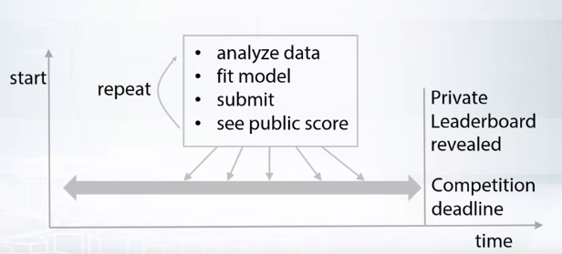
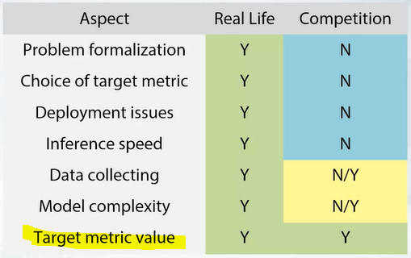

## How to Win a Data Science Competition

> 코세라 강의 참고, How to Win  a Data Science Competition : Learn from Top Kaggler
>
> https://www.coursera.org/learn/competitive-data-science

### Overview

- exploratory data analysis (탐색적 데이터 분석)
- basic and advanced feature generation and preprocessing (피쳐 생성 및 전처리)
- various model validation techniques (데이터 검증)
- data leakages (데이터 유출)
- competition's metirc optimization (컴피티션에 맞게 최적화)
- models ensembling (앙상블 기법)
- hyperparameter tuning (매개변수 조율)

### Competiton mecahnics

- Competitions’ concepts
  - Data
    - csv, text, file, db dump, image 등으로 제공
    - description을 읽어보면 feature 추출시 유용
  - Model
    - 거대하고 많은 component로 구성된 모델(stacking)
  - Submission
    - 제출해서 점수 확인
  - Evaluation
    - 모델이 좋은지 측정 -> score (**Accuracy, Logistic loss, AUC, RMSE, MAE** 등)
  - Leaderboard
    - 리더보드의 랭킹 확인
    - 그러나 이 점수가 최종은 아님
    - 대회중엔 Public Test을 사용하고, 최종 랭킹을 산정할 땐 Private Test를 사용
  
  

- Competition's platforms
  - Kaggle
  - DrivenData
  - CrowdAnalityx
  - CodaLab
  - DataScienceChallenge.net
  - Datascience.net
  - Single-competition sites (like KDD, VixDooM)

### Real World ML Pipeline

- Understanding of business problem
- Problem formalization
- Data collecting
- Data preprocessing
- Modelling
- Way to evaluate model in real life
- Way to deploy model

​	하지만 컴피티션에서는 비즈니스 문제가 정의되어 있고, 데이터도 존재한다. 단지 데이터 전처리 및 모델링을 수행하면 된다. 하지만 경우에 따라서는 일종의 인사이트, 보이지 않는 문제들을 정의하고 해결하기 위해 비즈니스 모델을 재정의하여 사용할 수 있다. 그리고 컴피티션 중 외부 데이터가 허용되는 경우도 있다.

​	The only thing we should take care about is target metrics value. **Speed, complexity and memory consumption**, 

all this doesn't matter as long as you're able to calculate it and re-produce your own results.

### Hardware

- Competition 적정 사양 : CPU 4+ cores, 16+ gb ram
- Storage : SSD!!
- Cloud resource : AWS, Azure, GCP

### Software

- Language : Numpy, Pandas, Matplotlib, Scikit-learn
- IDE : jupyter
- Special Packages : XGBoost, Keras, Light GBM, Catboost
- External tools
  - Vowpal Wabbit : 거대한 데이터셋을 핸들링할 때 유용
  - libfm, libffm : sparce한 CTR 데이터를 다룰 때 유용
  - fast_rgf : 또 다른 tree-based 방법

