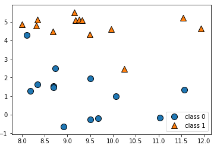

## 지도학습 (1)

### k-NN (k-Nearest Neighbors)

 	가장 간단한 머신러닝 알고리즘 중 하나. 새로운 데이터 포인트에 대해 예측할 때 훈련 데이터셋에서 가장 가까운 데이터 포인트, 즉 '최근접 이웃'을 찾는다.

```python
X, y = mglearn.datasets.make_forge()

# scattor plot
mglearn.discrete_scatter(X[:,0], X[:,1], y)
plt.legend(['class 0', 'class 1'], loc=4)
plt.xlabel('첫 번째 특성')
plt.ylabel('두 번째 특성')
```



#### knn 적용하여 예측

```python
from sklearn.model_selection import train_test_split

# 데이터셋 로드
X,y = mglearn.datasets.make_forge()
X_train, X_test, y_train, y_test = train_test_split(X, y, random_state=0)

# knn 분류기 생성
from sklearn.neighbors import KNeighborsClassifier
clf = KNeighborsClassifier(n_neighbors=3)

# 트레이닝 및 예측
clf.fit(X_train, y_train)
clf.predict(X_test)

# 결과 0.86%
"{:.2f}%".format(clf.score(X_test, y_test))
```

