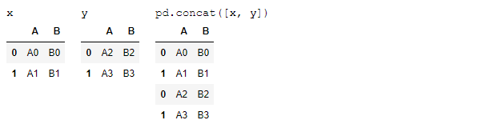
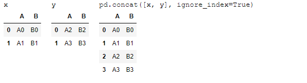
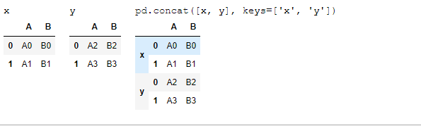
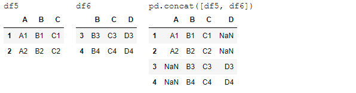
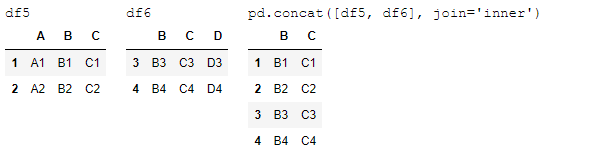
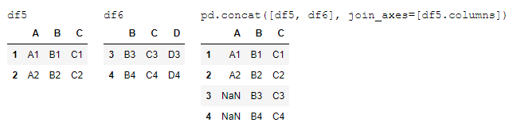
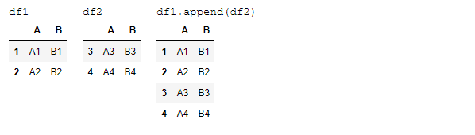

## 데이터셋 결합

```python
def make_df(cols, ind):
    """Quickly make a DataFrame"""
    data = {c: [str(c) + str(i) for i in ind]
            for c in cols}
    return pd.DataFrame(data, ind)

# example DataFrame
make_df('ABC', range(3))
```


### Concat, Append


#### Concat

```python
df1 = make_df('AB', [1, 2])
df2 = make_df('AB', [3, 4])
display('df1', 'df2', 'pd.concat([df1, df2])')
```

df1

|      |    A |    B |
| ---: | ---: | ---: |
|    1 |   A1 |   B1 |
|    2 |   A2 |   B2 |

df2

|      |    A |    B |
| ---: | ---: | ---: |
|    3 |   A3 |   B3 |
|    4 |   A4 |   B4 |

pd.concat([df1, df2])

|      |    A |    B |
| ---: | ---: | ---: |
|    1 |   A1 |   B1 |
|    2 |   A2 |   B2 |
|    3 |   A3 |   B3 |
|    4 |   A4 |   B4 |


```python
df3 = make_df('AB', [0, 1])
df4 = make_df('CD', [0, 1])
display('df3', 'df4', "pd.concat([df3, df4], axis='col')")
```

df3

|      |    A |    B |
| ---: | ---: | ---: |
|    0 |   A0 |   B0 |
|    1 |   A1 |   B1 |

df4

|      |    C |    D |
| ---: | ---: | ---: |
|    0 |   C0 |   D0 |
|    1 |   C1 |   D1 |

pd.concat([df3, df4], axis='col')

|      |    A |    B |    C |    D |
| ---: | ---: | ---: | ---: | ---: |
|    0 |   A0 |   B0 |   C0 |   D0 |
|    1 |   A1 |   B1 |   C1 |   D1 |


#### Concat 의 인덱스 복제

```python
x = make_df('AB', [0, 1])
y = make_df('AB', [2, 3])
y.index = x.index  # make duplicate indices!
display('x', 'y', 'pd.concat([x, y])')
```



​	동일한 인덱스가 있더라고, 그냥 붙여버린다. 옳지 못 하다.


##### verify_integrity

​	반복을 에러로 잡아낸다. verify_integrity 를 True로 설정하면 중복 인덱스 발생할 경우 예외가 발생한다.

```python
try:
    pd.concat([x, y], verify_integrity=True)
except ValueError as e:
    print("ValueError:", e)
```


##### ignore_index

​	ignore_index 플래그를 사용하여 중복 인덱스일 경우 무시할 수 있다.

```python
display('x', 'y', 'pd.concat([x, y], ignore_index=True)')
```



##### 새로운 키 생성 (멀티 인덱스)

```python
display('x', 'y', "pd.concat([x, y], keys=['x', 'y'])")
```




#### Concat 조인

```python
df5 = make_df('ABC', [1, 2])
df6 = make_df('BCD', [3, 4])
display('df5', 'df6', 'pd.concat([df5, df6])')
```




##### inner join

```python
display('df5', 'df6', "pd.concat([df5, df6], join='inner')")
```




##### 열 인덱스 지정 조인

```python
display('df5', 'df6', "pd.concat([df5, df6], join_axes=[df5.columns])")
```




#### append()

```python
display('df1', 'df2', 'df1.append(df2)')
```



​	판다스의 append() 메서드는 원래의 객체를 변경하지 않는 대신 결합된 데이터를 가지는 새로운 객체를 만든다. 새 인덱스와 데이터 버퍼를 생성하기 때문에 매우 효율적인 방식이라고 보기는 어렵다. 따라서 append 연산을 여러 번 수행할 계획이라면 **일반적으로 DataFrame 의 목록을 만들고 그 것들을 concat() 함수에 한 번에 전달하는 것이 더 바람직하다.**


----


### Merge, Join


#### 일대일 조인

```python
df1 = pd.DataFrame({'employee': ['Bob', 'Jake', 'Lisa', 'Sue'],
                    'group': ['Accounting', 'Engineering', 'Engineering', 'HR']})
df2 = pd.DataFrame({'employee': ['Lisa', 'Bob', 'Jake', 'Sue'],
                    'hire_date': [2004, 2008, 2012, 2014]})
display('df1', 'df2')
```


```python
df3 = pd.merge(df1, df2)
df3
```

