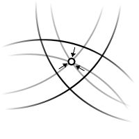

## GNSS 이해

>**참고** 
>
>[About_GPS.pdf](../../upload/About_GPS.pdf) 
>
>[Algorithms_of_Position_and_Velocity_Estimation_in_.pdf](..\..\upload\Algorithms_of_Position_and_Velocity_Estimation_in_.pdf) 
>
>https://cdn.intechopen.com/pdfs-wm/27712.pdf
>
> [10장 GPS [호환 모드].pdf](..\..\upload\10장 GPS [호환 모드].pdf) 
>
>13.전리층변화에따른GPS신호특성분석연구.pdf

### Constellation 

​	지구상에는 몇 가지 위성 항법 시스템이 존재, 미국의 GPS(Global Positioning System), 러시아의 GLONASS, 중국의 BeiDou, 유럽 연합의 Galileo.

​	이들은 약 20,000km 의 고도에서 우리 머리 위를 도는 20~30개의 위성 세트로 구성된다. 하루 중 언제라도 최소한 4개 이상의 위성을 이용할 수 있게 구성되어 있다. 이 위성들은 지속적으로 신호를 브로드캐스트하는데, 이 안에 타임스탬프도 포함되어 있다. 그러면 수신기는 신호를 수신하고 타임 스탬프를 현재 시간과 비교하므로 위성까지의 거리를 계산할 수 있다.

​	전송시간과 위성 궤도의 일부 파라미터를 알면 우주에서 위성의 위치를 계산할 수 있다. 물론 이러한 계산을 수행하는 방법에 대한 자세한 내용은 각 시스템마다 차이가 있다. 결국 스마트폰을 이용해 할 수 있는 것은,

- Pseudorange 계산
- 전송시 위성의 위치 계산

### Corrections

​	위성 신호를 사용할 때 사용자가 고려해야 할 것들이 존재한다. (전리층, 대류권 등의 오차) 보다 정확한 측위를 위해서는 위성간의 거리를 정확히 구하는 것이 중요. 예상되는 오류에 대한 내용을 신호에서 미리 제거하는 것이 좋다. 

​	가장 일반적으로는 전리층과 대류권의 오차를 보정한다. (전리층, 대류권 오차 모델 적용, 전리층 Kloubucher, 대류권 GPT(global pressure and temperature))

#### 보정에 필요한 주요 파라미터

- time of signal reception (신호 수신 시간)
- receiver’s approximate position (수신자의 대략적인 위치)
- the satellite’s position (위성의 위치)
- additional data, stored in the ephemeris data (이력 정보에 있는 추가 데이터)

### PVT Estimation

- 위성 위치 및 수신기와의 의사 거리를 구하고, 수신기의 위치, 속도 및 시간을 추정하는 알고리즘
- 일반적으로 위치와 시간만 추정하면 계산 가능하나 수신기의 속도를 추정(도플러 측정)을 통해 더욱 정확한 위치를 계산할 수 있다.

---

### 위치 계산

​	위성으로부터 송신된 신호를 이용해 좌표를 계산하기 위해서는 정밀한 시계가 필요한데, GPS 위성에는 고정밀의 원자 시계가 탑재되어 있으며, GPS 수신기는 필요한 정밀도에 따라서 원자 시계 또는 수정발진기를 이용한 시계 등이 탑재되어 있다. 위성으로부터 수신한 항법메시지를 통해 GPS 수신기의 시계와 GPS 위성의 시계를 비교한다.

> 
>
> 수신기로부터 여러 위성까지의 의사거리를 동시에 오차 보정해 중첩하면 수신기 위치의 최확값이 구해진다.

​	*  GPS 위성과 수신기간의 거리가 구해진다.** 그러나 **실제 전파 경로로 인한 오차, GPS 위성과 GPS 수신기에 내장된 시계의 오차, 수신기 내부 회로에서 발생하는 오차 등**으로 인해 이렇게 구한 거리는 실제의 거리가 아닌 **의사거리**(pseudorange)이다. GPS로부터 수신한 신호에는 항법메시지도 들어 있는데 의사거리는 항법메시지에 담겨 있는 각종 계수를 이용해 보정된다.

​	P(Y) 코드를 이용한 거리 계산도 C/A 코드를 이용한 계산과 비슷하다. 그러나 암호화 되어 있기 때문에 허용된 사용자만이 해독할 수 있다.GPS에서 위치는 [세계측지계](https://ko.wikipedia.org/w/index.php?title=세계측지계&action=edit&redlink=1)인 [WGS84](https://ko.wikipedia.org/wiki/WGS84) [좌표계](https://ko.wikipedia.org/wiki/지리_좌표계)에 따라 계산된다. 따라서 각 지역에 맞는 좌표계에 적용하기 위해서는 적절한 좌표 변환이 필요하다.

### 정확도와 오차

​	GPS 수신기에서 위치를 계산하기 위해서는 **현재의 시각, 위성의 위치, 신호의 지연량**이 필요하다. 위치 계산 오차는 이 가운데 주로 **위성의 위치와 신호 지연의 측정**으로부터 발생한다.	

​	**신호의 지연 시간은 GPS 위성으로부터 수신한 신호와 동일한 신호를 GPS 수신기에서 발생시켜 비교하여 얻는다.** 이 비교 과정에서 발생하는 오차는 수신기의 수신 상태가 양호한 경우, 부호 길이의 1% 정도이므로 C/A 코드에서는 약 1~10 ㎱이다. 전파의 [속도](https://ko.wikipedia.org/wiki/빛의_속도)를 고려하면 **1~3미터 정도의 오차**이다. 이는 신호 지연 측정 과정에서 발생하는 오차의 최소치이다. P(Y) 코드를 해독할 수 있는 경우, 부호 길이의 1%의 오차는 **약 30 센티미터**에 해당한다.

이 밖에 다음과 같은 오차가 발생한다.

- 전리층의 영향: ± 5 미터
- 천체력 오차: ± 2.5 미터
- 위성의 시계 오차: ± 2 미터
- 전파 경로에 따른 오차: ± 1 미터
- 대류권의 영향: ± 0.5 미터
- 수치 오차: ± 1 미터 이하

### 대기권 오차

​	[전리층](https://ko.wikipedia.org/wiki/전리층)과 [대류권](https://ko.wikipedia.org/wiki/대류권)은 **GPS에서 송신된 신호의 속도에 영향을 미친다.** **의사거리의 오차를 줄이는 데에는 대기권으로 인한 오차를 줄이는 것이 가장 효과적이다.** 한편, 대기권의 영향은 GPS 위성이 수신기의 바로 위에 있을 때 가장 작고, 지평선 부근에 위치할 때 가장 큰데, 이는 대기권을 통과하는 거리의 차이 때문이다.

​	전리층으로 인한 오차는 산란으로 인한 것으로 신호의 주파수에 따라서 달라진다. 군사용의 고정밀 GPS 수신기는 L1과 L2 채널을 동시에 수신함으로써 전리층 효과를 직접 보정할 수 있으나, **L1 채널만을 수신하는 일반적인 GPS 수신기는 다만 항법메시지에 포함된 오차 보정 계수를 사용해 전리층 효과를 보정한다.** 전리층 오차는 태양활동에 따라 그 효과가 변하는데, 태양활동 극대기일 때 전리층 오차는 가장 커진다.

​	대류권의 오차는 공기와 수증기로 인한 것인데 전리층 오차보다 그 변화가 빠르다. 수신기의 고도는 대류권 오차과 관련이 있는데, 이것은 GPS 위성 신호가 통과하는 거리가 고도에 따라 달라지기 때문이다.

​	DGPS 방식을 사용한 위치 결정에서는, 이미 좌표를 알고 있는 참조점에서 GPS 관측 결과로부터 계산한 좌표를 비교하여 해당 지역의 전리층과 대류권 오차 보정량을 구해 FM이나 간이 무선 회선을 통해 방송하기도 한다.

### 다중 경로에 따른 오차

​	GPS 신호는 다중 경로의 영향을 받는다. 수신기 주변의 건물 등의 지형 지물로 인해 위성으로부터 송신된 신호가 굴절, 반사되는데, 이로 인해 오차가 발생한다. 협상관기(Narrow Correlator)나 특별히 설계된 안테나 등의 기법을 사용해 오차를 보정한다. **움직이는 차량에 장착된 수신기의 경우 반사되어 들어오는 신호가 쉽게 수렴되지 않으므로 다중경로의 효과가 그렇게 심각하지 않다.**

### 천체력 및 위성 시계 오차

​	**항법 메시지는 12.5분마다 갱신되어 전송된다. 따라서 실제로는 항법 메시지가 현재보다 더 예전의 정보일 수 있다.** 예를 들어, GPS 위성이 정확한 궤도로 유지하기 위해 움직이는 경우, 그 이후 새로운 천체력이 수신되기 전까지 얼마 동안은, 수신기가 계산한 해당 위성의 위치가 실제 위치와는 일치하지 않는다. 또한, 위성에 탑재된 시계는 매우 정밀하지만 클럭 드리프트가 발생하기 때문에 위치 결정 결과에 **최대 2 미터 정도**의 오차가 생길 수 있다.

​	이와 같은 오차는 전리층 오차와 달리 몇 날 또는 몇 주간에 걸쳐서 변화하기 때문에 보다 안정적인 편에 속한다. 그러므로 더 정확한 궤도 정보와 이력(almanac)을 별개의 채널을 통해 사용함으로써 쉽게 오차를 보정할 수 있다.

### SA (Selective Availability)

​	SA(Selective Availability, 선택적 사용성)는 민간 부문의 사용을 제한하기 위하여 의도적으로 오차를 발생시키는 방법을 의미한다. SA가 적용된 GPS 신호를 사용한 측정에서는 수직방향으로 30 미터, 수평방향으로 10 미터 정도의 오차가 발생한다. 그러나 이와같은 오차는 매우 빨리 변하지 않기 때문에, 민간 부문에서는 DGPS (Differential GPS) 등의 방법을 사용해 오차를 없앨 수 있었다.

​	민간용의 GPS 사용을 제한하기 위해 도입된 SA는 아이러니하게도 걸프 전쟁 당시 공급이 충분하던 민간용 GPS 장비와 그에 비해 부족하던 군사용 GPS 장비의 공급으로 인해 제거되는 계기를 맞는다. 또한 미국연방항공청(FAA, Federal Aviation Administration)은 독자적인 라디오 항법 시스템을 유지하는 데 필요한 재정을 절감할 수 있다는 이유로 SA를 제거할 것을 지속적으로 요구하였다. 결국 빌 클린턴의 성명에 이어 2000년 5월 1일부터 SA의 오차를 0으로 설정함으로써 SA 기능이 실질적으로 제거되었다. SA 기능은 아직 완전히 제거된 것은 아니므로 오차량을 조정함으로써 언제든지 재도입할 수 있지만 그럴 가능성은 적으며 미국연방항공청에서도 SA를 재도입할 계획이 없다고 밝혔다.

​	SA가 없어진 이후, GPS에서 발생할 수 있는 가장 큰 오차는 전리층으로 인한 것이다. 물론 GPS 위성에서 오차 보정 계수를 송신하지만, 전리층의 불확실한 조건으로 인해 오차를 완전히 막을 수는 없다. 이는 GPS 위성에서 두 대역, L1과 L2 대로 신호를 동시에 송신하는 이유이기도 하다. 신호가 전달되는 경로에 따른 전리층 오차는 신호의 주파수와 총전자 함유량의 함수이다. 그러므로 주파수가 다른 두 대역의 신호가 도달하는 시간 차이를 측정함으로써 총전자 함유량을 구할 수 있고 따라서 전리층 지연도 계산된다.

​	GPS-RTK는 CPGPS라고도 불리며 C/A, P 코드뿐 아니라 반송파의 위상정보까지 이용하여 수평 1 cm,수직 2 cm 레벨의 정확도를 구현하여 GPS 나침반, 지적측량 등에 활용된다. 그 이상의 정확도가 필요한 경우에는 VLBI 기법이 이용된다.