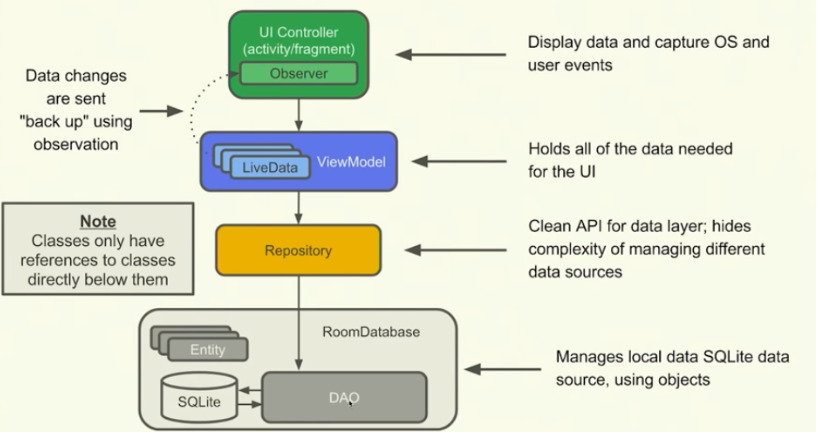

## Android Desigin Pattern - MVVM

### MVVM

​	마틴 파울러에 의해 나온 MVP 패턴에서 파생된 패턴. MVVM(Model-View-ViewModel) 패턴은 비즈니스 및 프레젠테이션 로직을 UI와 완전히 분리하는데 도움이 되며, 비즈니스 로직과 UI를 명확하게 분리하여 더 쉽게 테스트할 수 있고, 유지보수에 용이하다.
#### View

​	화면에 보이는 레이아웃 구조를 담당. UI과 관련된 로직을 수행.

#### ViewModel

​	**View에 연결된 데이터와 명령을 구현하고 변경 알림 이벤트를 통해 상태의 변경을 View에 알린다.** 그리고 상태 변경 알림을 받은 View는 변경을 적용할지 말지를 결정하게 된다. 

#### Model

​	사용하려는 데이터를 가지고 있는 비시각적 클래스. DTO (Data Transfer Object), POJO(Plain Old Java Object)나 엔티티 개체 등이 있다. 일반적으로 데이터를 액세스하거나 캐싱이 필요한 서비스  또는 레포지토리와 함께 사용된다.


### AAC JetPack

​	**AAC(Android Architecture Component)**

- AAC Components (LiveData, Lifecycle, ViewModel)

- DataBinding

- Koin (dependency injection)

- Coroutines

  

  


> https://www.youtube.com/watch?v=Y-uPcwBEEV4

#### Data Binding Library 추가

build.gradle(:app)

```groovy
android {
    compileSdkVersion 29
    buildToolsVersion "29.0.3"

    ...

    dataBinding {
        enabled = true
    }
}
```

```xml
dependencies {
 ...

    implementation "androidx.lifecycle:lifecycle-extensions:2.0.0"
}
```


