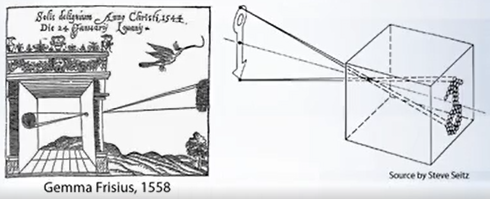
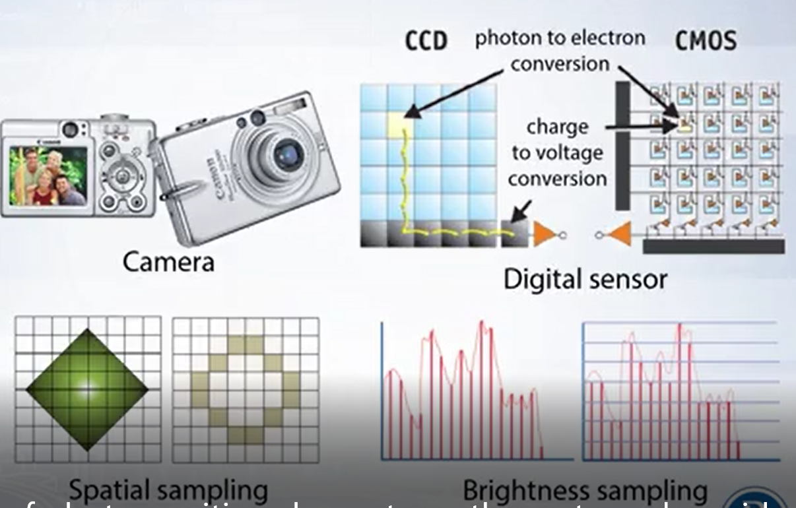
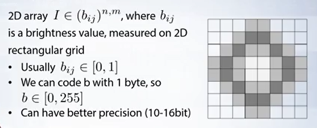

## Introduction and digital images

### Short introduction to computer vision

- Object Detection? 

  - What objects are seen in the image and where are there are located.
  - 이미지에서 보이는 물체는 뭐고, 어디에 위치하고 있냐를 아는 것
  - 아직까지 완벽한 알고리즘은 없어서 매일 매일 새롭게 나오고 있다.

- Image Classification

  - 도시 그림인가? 하늘색은 뭔가? 저 사람에 대해서는 뭐라고 할지? 등등 보통의 문제들

- image retrieval (이미지 데이터베이스)

  - Store the images and compare the current image with the stored.

  - 이미지 저장해놓고 현재 이미지와 비교

    

- Metric Vision

  - metric information from images
  - estimate the shape of the images
  - 카메라와 물체간의 상대적인 위치
  - 카메라와 물체간의 거리

- Human Vision
  - 인간은 지식에 기반하여 물체를 인식
  - 뇌의 25%는 시각에 투자 (추정)
  - 인간의 시각 시스템 기반하여 알고리즘이 많이 나온다. 쩔어쩔어
- David Marr (70s)의 Human Vision System
  - low-level image features (Primal sktetch)
    - directed edge segments
  - 2.5D sketch
    - binocular stereo
  - high-level technique (3D model)
    - knowledge 기반

- **Alexnet 이전의 얼굴 인식은 Viloa-Jones 알고리즘이었으나, 요즘 딥러닝때문에 세상이 많이 바뀌고있다. 딥러닝 비젼 시스템을 배워보자...**

---

### Short introduction to computer vision

- Optical image
  - 2D representation of a physical object, obtained by propagation of light through some optical system, depicting object contour and features.
  - 광학시스템의 빛의 전파에 의해 물체의 윤곽과 특징을 묘사하는 2D 표현
  - 일반적인 카메라, Fisheye, Tomography 등 종류 다양

- Pinhole camera model

  

  - 광학 시스템의 시초, (which allow humans to capture the shape of objects from projected light)
  - 모든 빛은 한 점을 지난다. (focal point; Center of Projection)

- Perspective distortion (원근 왜곡)
  - 사진의 세로선(주사선)은 평행하지 않고 한 점에서 모인다.
  - 그래서 원근 왜곡이 발생한다.
  - 처음 문제 제기한 사람은 레오나르도 다빈치

- Dimensionality Reduction Machine
  - 우리는 3D 세계를 2D로 찍는다. 그래서 정보의 일부가 버려짐 (차원 축소, 앵글값과 거리값 버려짐)
  - 유지되는 특성은 linearity(선형성) - 예를 들어 가로로 선 3개 있으면 사진찍어도 세개 있다.
  - 하지만 이런 선형성 또한 광학 효과로 인해 위반될 수 있다. (방사형 왜곡)
  - 방사형 왜곡으로 인한 직선이 휘어보임

- Modern digital camera

  

  - 현대식 디지털 카메라는 핀홀 카메라 모델을 기반으로 만들어졌다.

  - 다른 점은 광학 시스템이 복잡해지고, 디지털 센서(CMOS 같은거)가 쓰였다는 거

  - Spatial sampling (공간 샘플링) - Grayscale 이미지 0,1

  - Brightness sampling (밝기값 샘플링) - 밝기값을 1바이트로 표현 (0 ~255)

    

