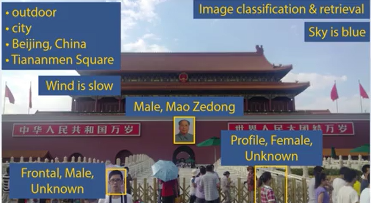
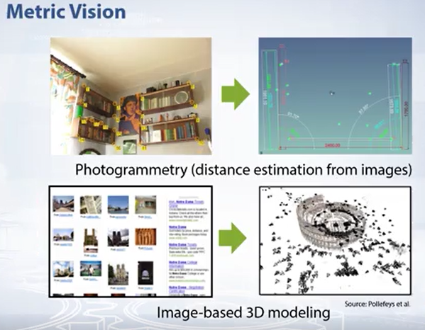

## Introduction and digital images

### Short introduction to computer vision

- Object Detection? 

  - What objects are seen in the image and where are there are located.
  - 이미지에서 보이는 물체는 뭐고, 어디에 위치하고 있냐를 아는 것
  - 아직까지 완벽한 알고리즘은 없어서 매일 매일 새롭게 나오고 있다.

- Image Classification

  - 도시 그림인가? 하늘색은 뭔가? 저 사람에 대해서는 뭐라고 할지? 등등 보통의 문제들

- image retrieval (이미지 데이터베이스)

  - Store the images and compare the current image with the stored.

  - 이미지 저장해놓고 현재 이미지와 비교

    

- Metric Vision

  - metric information from images
  - estimate the shape of the images
  - 카메라와 물체간의 상대적인 위치
  - 카메라와 물체간의 거리

- Human Vision
  - 인간은 지식에 기반하여 물체를 인식
  - 뇌의 25%는 시각에 투자 (추정)
  - 인간의 시각 시스템 기반하여 알고리즘이 많이 나온다. 쩔어쩔어
- David Marr (70s)의 Human Vision System
  - low-level image features (Primal sktetch)
    - directed edge segments
  - 2.5D sketch
    - binocular stereo
  - high-level technique (3D model)
    - knowledge 기반

- **Alexnet 이전의 얼굴 인식은 Viloa-Jones 알고리즘이었으나, 요즘 딥러닝때문에 세상이 많이 바뀌고있다. 딥러닝 비젼 시스템을 배워보자...**