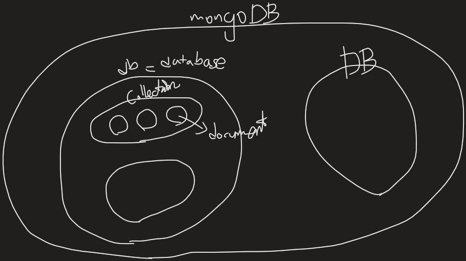

## 1. MongoDB 개요

---

### mongodb (www.mongodb.com)

- DBMS의 일종

- 통칭 NoSQL(Not Only SQL), 비관계형 데이터베이스

- 특징

  - Document-Oriented Storage

    기존의 관계형 DB 인 row 와 비슷한 개념으로 document 단위로 저장됨.

  - Full Index Support

    Index on any attribute, just like you're used to. (어떤 데이터 타입이든 인덱스를 걸 수 있음)

  - Replication & High Availability

    Replication : 여러 대의 컴퓨터에 DB를 동기화 하는 기법

  - Auto-Sharding

    데이터가 많이 쌓이면 느려짐. 검색하는 것이 느려질 수 있는데, 이를 위해 파티셔닝한다. 파티셔닝하면 성능 이슈가 존재, 분할하기 때문에 제한적인 성능을 가진다. 반면, 몽고디비는 데이터를 처음부터 분산시켜 저장하기 때문에, 느려지는 이슈가 없고, 하나의 컬렉션(테이블)처럼 읽어 와 사용할 수 있다.

  - Querying

     SQL 을 전혀 사용하지 않는다. Document-based queries, 직관적이기는 하나 기존 모델러들은 헷갈림....

  - Fast In-Place Updates

    DB 사용시 background 처리, 성능 free.

  - Map / Reduce

    엄청나게 많은 데이터를 통계내는 데 유용한 기능. 추 후 정리가 필요한 방대한 분야

  - GridFS

    분산 파일 저장을 몽고디비가 대신 해준다. 파일에 대한 관리도 해준다는 뜻

