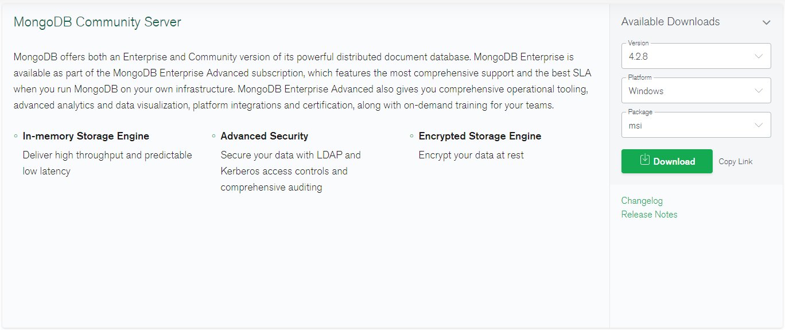
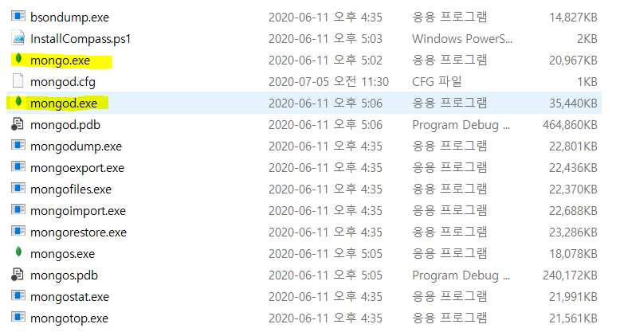
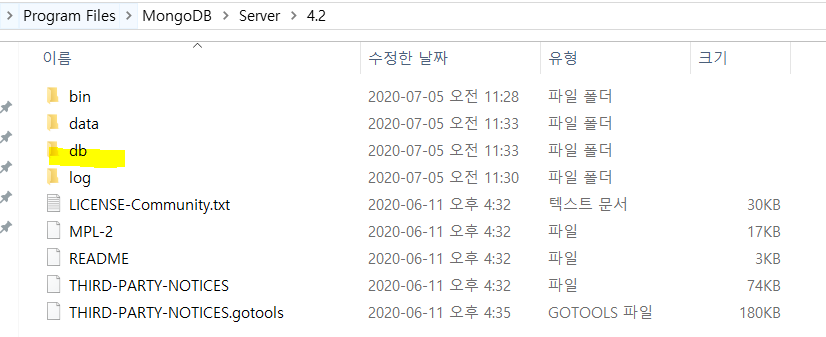
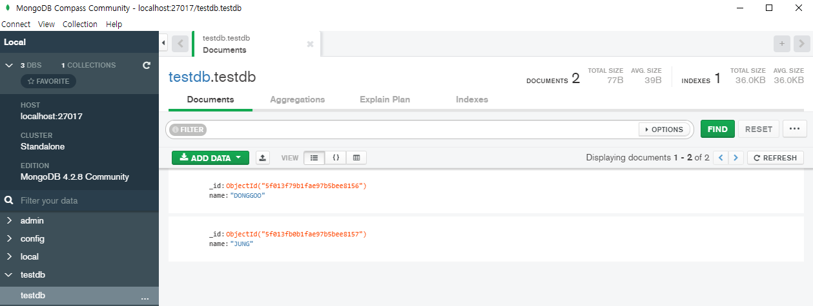

## 2. 다운로드 및 실행

---

### 다운로드, 설치 및 실행

- mongdb.com > Software > Community Server

  

- MongoDB Server 설치 (기본 경로 : C:\Program Files\MongoDB\Server\4.2\bin)

  - mongo.exe - 클라이언트 / mongod.exe - 실제 실행 파일 (서버)

  

- MongoDB의 root directory에 db라고 새 폴더를 만든다. 여기에 실질적인 데이터베이스를 성성.



### 서버 실행 (mongod)

```powershell
C:\Program Files\MongoDB\Server\4.2\bin
λ mongod --dbpath=../db
2020-07-05T11:36:47.420+0900 I  CONTROL  [main] Automatically disabling TLS 1.0, to force-enable TLS 1.0 specify --sslDisabledProtocols 'none'
2020-07-05T11:36:47.916+0900 W  ASIO     [main] No TransportLayer configured during NetworkInterface startup
2020-07-05T11:36:47.918+0900 I  CONTROL  [initandlisten] MongoDB starting : pid=18860 port=27017 dbpath=../db 64-bit host=DESKTOP-P61M1JD
2020-07-05T11:36:47.918+0900 I  CONTROL  [initandlisten] targetMinOS: Windows 7/Windows Server 2008 R2
2020-07-05T11:36:47.919+0900 I  CONTROL  [initandlisten] db version v4.2.8
2020-07-05T11:36:47.919+0900 I  CONTROL  [initandlisten] git version: 43d25964249164d76d5e04dd6cf38f6111e21f5f
2020-07-05T11:36:47.920+0900 I  CONTROL  [initandlisten] allocator: tcmalloc
2020-07-05T11:36:47.920+0900 I  CONTROL  [initandlisten] modules: none
2020-07-05T11:36:47.921+0900 I  CONTROL  [initandlisten] build environment:
2020-07-05T11:36:47.921+0900 I  CONTROL  [initandlisten]     distmod: 2012plus
2020-07-05T11:36:47.921+0900 I  CONTROL  [initandlisten]     distarch: x86_64
2020-07-05T11:36:47.921+0900 I  CONTROL  [initandlisten]     target_arch: x86_64
2020-07-05T11:36:47.922+0900 I  CONTROL  [initandlisten] options: { storage: { dbPath: "../db" } }
2020-07-05T11:36:47.929+0900 I  STORAGE  [initandlisten] exception in initAndListen: IllegalOperation: Attempted to create a lock file on a read-only directory: ../db, terminating
2020-07-05T11:36:47.933+0900 I  NETWORK  [initandlisten] shutdown: going to close listening sockets...
2020-07-05T11:36:47.933+0900 I  -        [initandlisten] Stopping further Flow Control ticket acquisitions.
2020-07-05T11:36:47.935+0900 I  CONTROL  [initandlisten] now exiting
2020-07-05T11:36:47.935+0900 I  CONTROL  [initandlisten] shutting down with code:100
```

### 클라이언트 실행 (mongo)

```powershell
C:\Program Files\MongoDB\Server\4.2\bin
λ mongo
MongoDB shell version v4.2.8
connecting to: mongodb://127.0.0.1:27017/?compressors=disabled&gssapiServiceName=mongodb
```

### testdb 만들어 사용해보기

```powershell
> use testdb                                                                 
switched to db testdb                                                        
> db.testdb.save({'name':'DONGGOO'})                                         
WriteResult({ "nInserted" : 1 })                                             
> db.testdb.save({'name':'JUNG'})                                            
WriteResult({ "nInserted" : 1 })                                             
>                                                                            
> db.testdb.find()                                                           
{ "_id" : ObjectId("5f013f79b1fae97b5bee8156"), "name" : "DONGGOO" }         
{ "_id" : ObjectId("5f013fb0b1fae97b5bee8157"), "name" : "JUNG" }            
>                                                                                                                            
> db.testdb.find().explain()                                                 
                                                                             
        "queryPlanner" : {                                                   
                "plannerVersion" : 1,                                        
                "namespace" : "testdb.testdb",                               
                "indexFilterSet" : false,                                    
                "parsedQuery" : {                                            
                                                                             
                },                                                           
                "queryHash" : "8B3D4AB8",                                    
                "planCacheKey" : "8B3D4AB8",                                 
                "winningPlan" : {                                            
                        "stage" : "COLLSCAN",                                
                        "direction" : "forward"                              
                },                                                           
                "rejectedPlans" : [ ]                                        
        },                                                                   
        "serverInfo" : {                                                     
                "host" : "DESKTOP-P61M1JD",                                  
                "port" : 27017,                                              
                "version" : "4.2.8",                                         
                "gitVersion" : "43d25964249164d76d5e04dd6cf38f6111e21f5f"    
        },                                                                   
        "ok" : 1                                                             
}                                                                            
```

