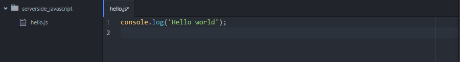
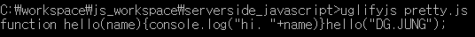

## Node.js started (1)

---

- 강의 : [생활코딩](https://opentutorials.org/module/2026/11850)
- 문서 : [Node.js Docs](https://nodejs.org/en/docs/)

---

**구글의 V8 엔진 위에서 구현된 자바스크립트를 위한 런타임 환경**

### 개`요

- 1990년, Tim Berners-Lee, Web의 탄생
- 1994년, Marc Andreessen Netscape 웹 브라우저
  - 넷스케이프의 상업적 성공으로 웹과 함께 폭발적인 성장을 이룸.
- 1995년, Java Script, Brendan Eich
  - Web 이 정적인 문서였다면, 자바스크립트로 인해 동적인 기술이 되었다. 사용자와 상호 작용을 하는 등의 복합적인 기능으로 애플리케이션으로 발전 가능하게 되었다. 자바 스크립트는 웹이라는 울타리 안에 있던 기술이었다. (최초의 자바스크립트는 웹에서만 동작할 수 있었기에, 이전의 웹이 중요하지 않던 환경에서는 자바스크립트가 각광받지 못 했다. 또한 비개발자 위주로 개발되어 개발자들에게 인기가 없었다.)
- 2004년, Google GMAIL, GMAP 발표. (순수한 웹 애플리케이션, 자바스크립트 사용.)
  - 기존의 자바나 플래쉬, 액티브X 등을 사용하지 않고, 자바스크립트, CSS 등을 활용한 구글의 웹 애플리케이션의 개발로 Web 진영의 지각 변동이 생김.
  - PURE WEB - 한 번 개발하면 어디서든 동작. 웹 클라이언트만 있다면 누구든지 사용 가능.
- 2008년, Google Chrome V8 (자바스크립트의 성능 최적화를 위한 엔진, 오픈소스로 공개)
  - 자바스크립트가 웹에 국한되지 않고, 어디서든 사용할 수 있는 환경이 가속화됨. 자바 스크립트의 팔자가 폈다!
- 2009년, Ryan Dahl Node.js
  - 기본적으로 V8 엔진을 자바 스크립트 엔진으로 사용하고, Event-driven(자바스크립트의 개발 방식) + non-blocking     IO 방식을 결합. 서버에서도 동작하는 자바스크립트로 확대.

#### Node.js 장점 (현재 주목받는 이유)

1. 속도 빠름 (구글 엔진 덕분)
2. Non-blocking IO 방식으로 잘 부합하게만 짜면 성능 극대화
3. 웹 브라우저, 웹 서버에서 동일한 자바 스크립트라는 언어를 사용함으로써 풀스택 가능

---

### Node.js 설치 및 실행

- nodejs.org 접속 후 다운로드

- cmd > node --version > version 확인

- 실행

  - Atom 기준,

    - File > Add Folder Project > Node.js workspace 추가

    - Add File > hello.js 만들기

    - node.js에서 js처럼 console.log 가능

      


---

### Node.js 간단한 웹앱 실행

​	https://nodejs.org/en/about/ 에 들어가면, node.js를 설명하는 코드가 있다. 복사해오자.

```javascript
const http = require('http');

const hostname = '127.0.0.1';
const port = 3000;

const server = http.createServer((req, res) => {
  res.statusCode = 200;
  res.setHeader('Content-Type', 'text/plain');
  res.end('Hello World');
});

server.listen(port, hostname, () => {
  console.log(`Server running at http://${hostname}:${port}/`);
});
```

- webServer.js 로 위의 코드를 만들어 실행 (web server의 짧은 실행 코드)

  ```
  > node webServer.js
  
  Server running at http://127.0.0.1:3000/
  ```

---

### 인터넷 동작 방법

- 서버, 클라이언트, IP, 포트의 개념
  - 클라이언트 (요청하는 쪽), 서버 (요청받는 쪽, 응답하는 쪽)
  - 도메인에 맵핑된 IP를 통해 접속한다. (www.naver.com 은 도메인 네임)
- 포트
  - 0 ~ 65535 개의 포트가 존재함
  - 예를 들어 80번 포트를 웹서버로 하고자 한다면 80번 포트에 연결한다. 이 때 서버는 80번 포트를 바라보게 되는데 이 것을 listen 하고 있다고 한다. (http: 80번)

---

### Module & Uglify

1. 기초

   module  은 일종의 부품과도 같은 것.

   Require 함수 = module  추가하는 함수 (import와 유사)

   ES6 에 const가 추가됨. (const, 상수)

   ```javascript
   const http = require('http')
   > http 라는 상수에 HTTP 모듈을 로드함.
   ```

   

2. NPM

   Node Package Manager 의 약어.

   ​	Date, String, Array 등 javascript가 제공하는 모듈. OS, http 등은 node.js 가 제공하는 모듈. 그렇다면 다른 사람들이 만들어 놓은 모듈들을 추가하는 방법이 있을테고, 그 것이 NPM이다.

   ​	모듈의 설치, 삭제, 업그레이드, 의존성 관리 등을 해준다. 고로 npm을 잘 다루는 방법을 알아야 한다. (www.npmjs.com 에서 모듈 검색 가능) 

   - NPM에서 설치할 수 있는 것. 모듈 or 독립적인 앱.

   - 설치시 -g(global) 변수의 유무에 따라 달라짐. 글로벌로 설치시 독립적인 앱으로 설치되어 컴퓨터 내 어디에서든 사용 가능하나, 로컬로 설치시, node 적용된 현 프로젝트에서 모듈로써 동작하게 된다.

     

   - 예시 ) Uglify

     ```javascript
     // pretty.js
     
     function hello(name) {
         console.log('Hi, ' + name)
     }
     
     hello('DG JUNG')
     ```

     - $ uglify pretty.js

       

     - Uglify-js를 이용해서 이렇게 바꾸면, 가독성이 후져지지만, 공백 등을 제거해서 용량 감소 등의 효과가 있다. 겁나 유용하니까, 배포할 때는 반드시 어글리하게 코드를 돌리자. 필수 프로그램!!!!!

     - $uglifyjs pretty.js     -o uglified.js -m

       - 이건 변수명까지 완전히 mangle해 버린다. -o 옵션을 이용해서 새로운 파일명으로 저장하자.
       - jquery.js > jquery.min.js 처럼 사용하는 것이 가장 보편적인 예