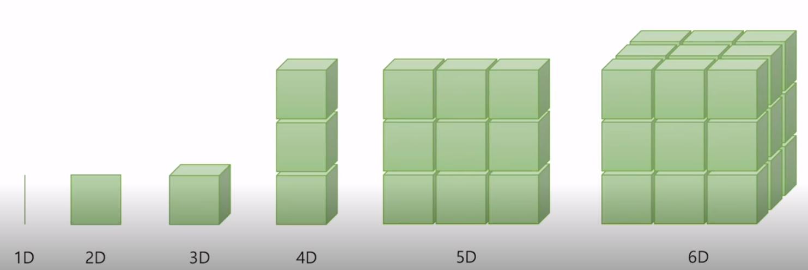
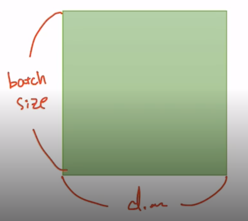
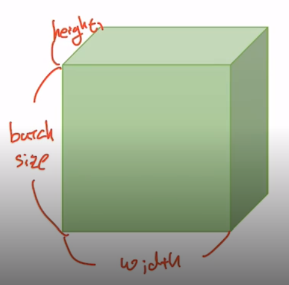
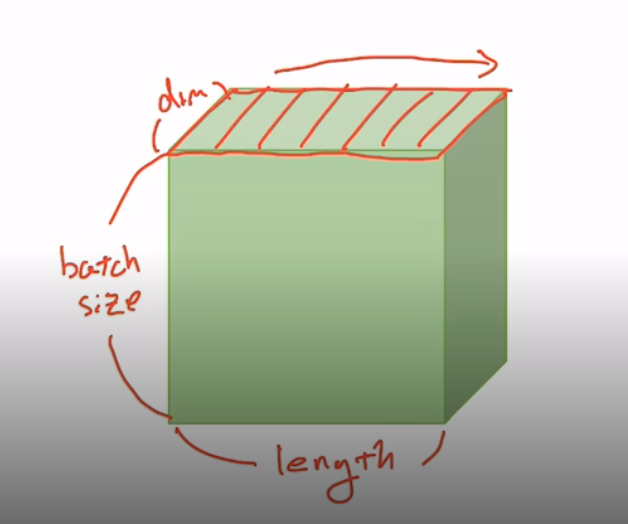

## PyTorch 기본 연산

- Vector, Matrix and Tensor
- Numpy Review
- PyTorch Tensor Allocation
- Matrix Multiplication
- Other Basic Ops

### Vector, Matrix, Tensor

---

- 1차원 - Vector
- 2차원 - 행렬, Matrix
- 3차원 - Tensor
- 4차원 이상 ~ 

#### PyTorch Tensor Shape Convention

---

- 매 연산마다 Tensor, Matrix 등의 크기를 잘 알고 있어야 한다.
- 2D : |t| = mul(batch size, dim) - tensor는 batch size(64) x dimension(256)

- 3D Tensor (Typical Computer vision)
- |t| = mul(batch size, width, height) - 높이, 가로, 깊이

- 3D Tensor (Typical Natural Language Processing)
- |t| = mul(batch size, length, dim)
- 상위 네모 한 칸이 문장 하나.

