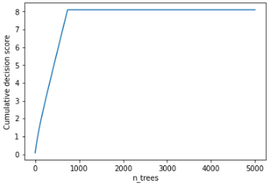
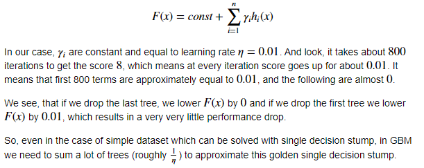

## Will performance of GBDT model drop dramatically if we remove the first tree?

https://colab.research.google.com/drive/1zwHVuAjn3BbtwzFU8fMkNGEsL1Wn02UO#scrollTo=Ay2BceDB4O5D


### Module import

```python
import numpy as np
import matplotlib.pyplot as plt
import seaborn as sns
%matplotlib inline

from sklearn.metrics import log_loss
from sklearn.tree import DecisionTreeClassifier
from sklearn.ensemble import GradientBoostingClassifier
from sklearn.datasets import make_hastie_10_2
from sklearn.model_selection import train_test_split

def sigmoid(x):
  return 1 / (1 + np.exp(-x))
```


### Make dataset

​	1-D 정규분포 데이터셋을 만든다. 그리고 객체가 양수이면 1, 그렇지 않으면 0을 예측하기로 한다.

```python
X_all = np.random.randn(5000, 1)
y_all = (X_all[:, 0] > 0) * 2 - 1

X_train, X_test, y_train, y_test = train_test_split(X_all, y_all, test_size=0.5, random_state=42)
```

​	데이터셋이 워낙 간단해서 Single decision stump 로 해결 가능하다.

```python
clf = DecisionTreeClassifier(max_depth=1)
clf.fit(X_train, y_train)

print('Accuracy for a single decision stump : {}'.format(clf.score(X_test, y_test)))
```

```
> Accuracy for a single decision stump : 0.9996
```


---


### Learn GBM

​	그러나 사실 올바르게 분류하려면 800 개의 트리가 필요하다.

```python
clf = GradientBoostingClassifier(n_estimators=5000, learning_rate=0.01, max_depth=3, random_state=0)
clf.fit(X_train, y_train)

y_pred = clf.predict_proba(X_test)[:, 1]
print("Test logloss: {}".format(log_loss(y_test, y_pred)))
```

```
> Test logloss: 0.0035533232664089654
```

```python
def compute_loss(y_true, scores_pred):
    '''
        Since we use raw scores we will wrap log_loss 
        and apply sigmoid to our predictions before computing log_loss itself
    '''
    return log_loss(y_true, sigmoid(scores_pred))
    

'''
    Get cummulative sum of *decision function* for trees. i-th element is a sum of trees 0...i-1.
    We cannot use staged_predict_proba, since we want to maniputate raw scores
    (not probabilities). And only in the end convert the scores to probabilities using sigmoid
'''
cum_preds = np.array([x for x in clf.staged_decision_function(X_test)])[:, :, 0] 

print ("Logloss using all trees:           {}".format(compute_loss(y_test, cum_preds[-1, :])))
print ("Logloss using all trees but last:  {}".format(compute_loss(y_test, cum_preds[-2, :])))
print ("Logloss using all trees but first: {}".format(compute_loss(y_test, cum_preds[-1, :] - cum_preds[0, :])))
```

```
> Logloss using all trees:           0.0035533232664089654
> Logloss using all trees but last:  0.0035533232664087854
> Logloss using all trees but first: 0.0035265113022998605
```

​	차이가 있지만 예상만큼 크지는 않다. 또한 첫 번째 트리를 제거해도 전체 모델이 여전히 잘 동작한다.

```python
# Pick an object of class 1 for visualisation
plt.plot(cum_preds[:, y_test == 1][:, 0])

plt.xlabel('n_trees')
plt.ylabel('Cumulative decision score');
```



​	Decision function 은 약 800회 반복 될 때까지 거의 선형으로 개선된 다음 중지된다. 그리고 이 선의 기울기는 우리가 GBM으로 설정한 학습 속도와 연관이 있다. 부스팅을 공식화하면 다음과 같다 : 



​	좀 더 확실한 증명을 위해 learning rate를 8로 변경한다.

```python
clf = GradientBoostingClassifier(n_estimators=5000, learning_rate=8, max_depth=3, random_state=0)
clf.fit(X_train, y_train)

y_pred = clf.predict_proba(X_test)[:, 1]
print("Test logloss: {}".format(log_loss(y_test, y_pred)))

cum_preds = np.array([x for x in clf.staged_decision_function(X_test)])[:, :, 0] 

print ("Logloss using all trees:           {}".format(compute_loss(y_test, cum_preds[-1, :])))
print ("Logloss using all trees but last:  {}".format(compute_loss(y_test, cum_preds[-2, :])))
print ("Logloss using all trees but first: {}".format(compute_loss(y_test, cum_preds[-1, :] - cum_preds[0, :])))
```

```
> Logloss using all trees:           2.9962335366621815e-06
> Logloss using all trees but last:  3.128642287905693e-06
> Logloss using all trees but first: 2.005891400784598
```


​	좀 더 현실적인 데이터셋을 기반으로 GBM을 학습하고 싶다면 ``X_all, y_all = make_hastie_10_2(random_state=0)`` 로 테스트해보길 바람.